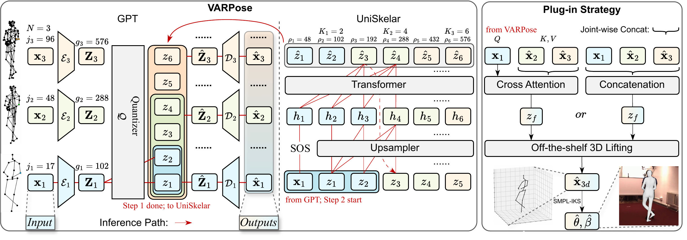

# VARPose: Flexible 2D Pose Densification via Visual Autoregressive Modeling for Enhanced 3D Lifting


[](https://arxiv.org/pdf/2608.02214)



Visual Auto-Regressive Modeling (VAR) has excelled in natural image generation via next-scale prediction, but its use on topology-structured data like human skeletons is still unexplored. VARPose is proposed to adaptively densify 2D sparse poses, thereby enriching the anatomic information available for 3D lifting models. Our core contributions are twofold. First, we introduce a Granularity-agnostic Pose Tokenizer (GPT), which employs a single hybrid codebook and a residual quantization strategy to encode poses of varying densities into a unified, multi-scale discrete representation. Our results demonstrate the strong generalizability of this representation. By decoupling the representation from the projection, we can successfully decode novel pose granularities using a frozen codebook with a retrained decoder. Second, we propose UniSkelar, a unified autoregressive model that treats "joint density" as "scale". UniSkelar learns to predict the token sequence for the next density level in a coarse-to-fine manner, conditioned on the sparsest pose. VARPose not only outperforms state-of-the-art methods and generalizes to unseen granularities, but also confers tangible performance gains to downstream tasks, such as 3D Pose Estimation and Human Mesh Recovery, through 2D pose densification. Our paper is available at https://arxiv.org/pdf/2608.02214.

---

## Directory layout

Run all commands from the repository root unless noted otherwise.

```text
VARPose/
├── run.py                                         # Unified entry point: training / evaluation / tasks
├── data/
│   └── source_data/
│       ├── msst_data_h36m_vp3d_standard.pkl       # Human3.6M 17-48-96 hierarchical poses (GPT / UniSkelar)
│       └── msst_17_21_25_48_96_coco_192_384_768.pkl  # Multi-granularity data (flexible-granularity decoder)
├── checkpoints/
│   ├── varpose_gpt_hierarchical/
│   │   └── vqvae_best.pth                          # Granularity-agnostic Pose Tokenizer (GPT / HierarchicalVQVAE)
│   ├── varpose_ar/
│   │   └── var_best.pth                            # UniSkelar autoregressive model
│   ├── flexible_granularity_decoder/
│   │   ├── decoder_coco_17.pth                     # Flexible-granularity decoder (COCO-17)
│   │   ├── decoder_192.pth                         # Flexible-granularity decoder (192 joints)
│   │   ├── decoder_384.pth                         # Flexible-granularity decoder (384 joints)
│   │   └── decoder_768.pth                         # Flexible-granularity decoder (768 joints)
│   └── h36m2smpl_layer6/
│       └── h36m2smpl_best.pth                      # H36M-to-SMPL mesh regression head
└── logs/                                            # Training / evaluation logs (TensorBoard)
```

## Data

All datasets and pretrained checkpoints below can be downloaded from
[🤗 HuggingFace: Tiantian3927/VARPose](https://huggingface.co/Tiantian3927/VARPose).

| File | Description |
| --- | --- |
| `data/source_data/msst_data_h36m_vp3d_standard.pkl` | Human3.6M multi-scale (17-48-96) hierarchical pose data for GPT / UniSkelar |
| `data/source_data/msst_17_21_25_48_96_coco_192_384_768.pkl` | Multi-granularity data for the flexible-granularity decoder |

## Checkpoints

Pretrained checkpoints can be downloaded from
[🤗 HuggingFace: Tiantian3927/VARPose](https://huggingface.co/Tiantian3927/VARPose).

| File | Description |
| --- | --- |
| `checkpoints/varpose_gpt_hierarchical/vqvae_best.pth` | Granularity-agnostic Pose Tokenizer (GPT / HierarchicalVQVAE) |
| `checkpoints/varpose_ar/var_best.pth` | UniSkelar autoregressive model |
| `checkpoints/flexible_granularity_decoder/decoder_coco_17.pth` | Flexible-granularity decoder (COCO-17) |
| `checkpoints/flexible_granularity_decoder/decoder_192.pth` | Flexible-granularity decoder (192 joints) |
| `checkpoints/flexible_granularity_decoder/decoder_384.pth` | Flexible-granularity decoder (384 joints) |
| `checkpoints/flexible_granularity_decoder/decoder_768.pth` | Flexible-granularity decoder (768 joints) |
| `checkpoints/h36m2smpl_layer6/h36m2smpl_best.pth` | H36M-to-SMPL mesh regression head |

## Environment

All commands in this repository (top-level and `third_parties/`) run under a single
conda environment, `varpose` (Python 3.10.6, PyTorch 2.7.1 + CUDA 11.8).

```bash
conda create -n varpose python=3.10.6 -y && conda activate varpose
pip install -r ./requirements.txt
```

## Quick start

### 1. GPT (Granularity-agnostic Pose Tokenizer)

**Training**

```bash
CUDA_VISIBLE_DEVICES=0 python run.py --trainer=vqvae \
    --data_path=data/source_data/msst_data_h36m_vp3d_standard.pkl \
    --save_dir=checkpoints/trainer_vqvae \
    --log_dir=logs/trainer_vqvae \
    --vqvae_model=HierarchicalVQVAE \
    --train
```

**Evaluation** (using pretrained checkpoint `checkpoints/varpose_gpt_hierarchical/vqvae_best.pth`)

```bash
CUDA_VISIBLE_DEVICES=0 python run.py --trainer=vqvae \
    --data_path=data/source_data/msst_data_h36m_vp3d_standard.pkl \
    --save_dir=checkpoints/trainer_vqvae \
    --log_dir=logs/trainer_vqvae \
    --vqvae_model=HierarchicalVQVAE \
    --checkpoint_path=checkpoints/varpose_gpt_hierarchical/vqvae_best.pth \
    --test
```

### 2. UniSkelar (Autoregressive Densification)

**Training**

```bash
CUDA_VISIBLE_DEVICES=0 python run.py --trainer=var \
    --data_path=data/source_data/msst_data_h36m_vp3d_standard.pkl \
    --save_dir=./checkpoints/trainer_var \
    --log_dir=./logs/trainer_var \
    --vqvae_model_path=checkpoints/varpose_gpt_hierarchical/vqvae_best.pth \
    --vqvae_model=HierarchicalVQVAE \
    --train
```

**Evaluation** (using pretrained checkpoint `checkpoints/varpose_ar/var_best.pth`)

```bash
CUDA_VISIBLE_DEVICES=0 python run.py --trainer=var \
    --data_path=data/source_data/msst_data_h36m_vp3d_standard.pkl \
    --save_dir=./checkpoints/trainer_var \
    --log_dir=./logs/trainer_var \
    --checkpoint_path=checkpoints/varpose_ar/var_best.pth \
    --vqvae_model_path=checkpoints/varpose_gpt_hierarchical/vqvae_best.pth \
    --vqvae_model=HierarchicalVQVAE \
    --batch_size=16 \
    --test
```

### 3. Flexible-Granularity Decoder

**Training**

```bash
CUDA_VISIBLE_DEVICES=0 python run.py --trainer=decoder \
    --data_path=data/source_data/msst_17_21_25_48_96_coco_192_384_768.pkl \
    --save_dir=./checkpoints/trainer_decoder \
    --log_dir=./logs/trainer_decoder \
    --gt_patch=192 \
    --vqvae_model_path=checkpoints/varpose_gpt_hierarchical/vqvae_best.pth \
    --train
```

**Evaluation**

```bash
CUDA_VISIBLE_DEVICES=0 python run.py --trainer=decoder \
    --data_path=data/source_data/msst_17_21_25_48_96_coco_192_384_768.pkl \
    --save_dir=./checkpoints/trainer_decoder \
    --log_dir=./logs/trainer_decoder \
    --gt_patch=coco_17 \
    --checkpoint_path=checkpoints/flexible_granularity_decoder/decoder_coco_17.pth \
    --var_model_path=checkpoints/varpose_ar/var_best.pth \
    --vqvae_model_path=checkpoints/varpose_gpt_hierarchical/vqvae_best.pth \
    --test
```

or simply:

```shell
./scripts/fewshot_decoder_adaptation_infer.sh
```

### 4. SMPL Mesh Evaluation

```bash
CUDA_VISIBLE_DEVICES=0 python run.py --task smpl_mesh_eval_task \
    --npz_path path/to/predictions.npz \
    --h36m2smpl_checkpoint checkpoints/h36m2smpl_layer6/h36m2smpl_best.pth
```

For the input `predictions.npz`, refer to `third_parties/mixste/README.md` (section *HMR Mesh Recovery*); its output file `xxx_integrated.npz` is the expected input.

### 5. Computational Efficiency Analysis

```bash
# HierarchicalVQVAE
CUDA_VISIBLE_DEVICES=0 python run.py --task complexity_analysis_task \
    --model HierarchicalVQVAE

# VARForSkeleton
CUDA_VISIBLE_DEVICES=0 python run.py --task complexity_analysis_task \
    --model VARForSkeleton
```

### 6. 2D-to-3D Lifting Experiments

For the downstream lifting experiments (mixste, gfpose, finepose, d3dp), please refer to the README under each directory in `third_parties/`.

---

## Acknowledgements

This repository builds upon several outstanding open-source projects. We sincerely thank the authors of:

- **MixSTE** — Seq2seq Mixed Spatio-Temporal Encoder for video 3D human pose estimation (CVPR 2022), used for the HPE / HMR lifting experiments (`third_parties/mixste/`, [JinluZhang1126/MixSTE](https://github.com/JinluZhang1126/MixSTE.git))
- **GFPose** — Learning 3D Human Pose Prior with Gradient Fields (CVPR 2023) (`third_parties/gfpose/`, [Embracing/GFPose](https://github.com/Embracing/GFPose.git))
- **FinePOSE** — Fine-Grained Prompt-Driven 3D Human Pose Estimation via Diffusion Models (CVPR 2024) (`third_parties/finepose/`, [PKU-ICST-MIPL/FinePOSE_CVPR2024](https://github.com/PKU-ICST-MIPL/FinePOSE_CVPR2024.git))
- **D3DP** — Diffusion-Based 3D Human Pose Estimation with Multi-Hypothesis Aggregation (ICCV 2023) (`third_parties/d3dp/`, [paTRICK-swk/D3DP](https://github.com/paTRICK-swk/D3DP.git))
- **CPN** — Cascaded Pyramid Network for 2D human pose estimation (`third_parties/cpn/`, [GengDavid/pytorch-cpn](https://github.com/GengDavid/pytorch-cpn))
- **SMPL-IKS** — Inverse Kinematic Solver for 3D Human Mesh Recovery (`third_parties/smpliks/`, [Z-Z-J/SMPL-IKS](https://github.com/Z-Z-J/SMPL-IKS))
- **Pose2Mesh** — Graph Convolutional Network for 3D Human Pose and Mesh Recovery from a 2D Human Pose (ECCV 2020); inspired our H36M-to-SMPL mesh evaluation module ([hongsukchoi/Pose2Mesh_RELEASE](https://github.com/hongsukchoi/Pose2Mesh_RELEASE.git))
- **VARSR** — Visual Autoregressive Modeling for Image Super-Resolution (ICML 2025); its next-scale-prediction VAR paradigm inspired our autoregressive pose densification framework ([quyp2000/VARSR](https://github.com/quyp2000/VARSR.git))

## Citation

If you find this work useful, please consider citing:

```bibtex
@inproceedings{varpose2026,
  title     = {VARPose: Flexible 2D Pose Densification via Visual Autoregressive Modeling for Enhanced 3D Lifting},
  author    = {Pu, Kaiyuan and Yang, Tiantian and Zeng, Dan},
  booktitle = {Proceedings of the 34th ACM International Conference on Multimedia (MM '26)},
  year      = {2026}
}
```

<div align="center">
<i>This repository is released under the MIT License.</i>
</div>
